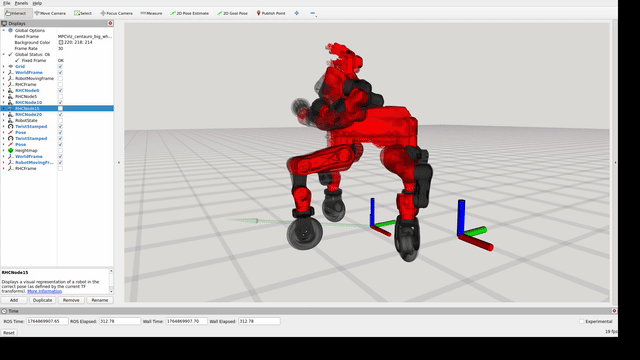

# MPCViz

MPCViz is a lightweight RViz2 front-end for inspecting receding-horizon control (RHC) plans and measured robot states in real time. The library focuses solely on visualization: you decide how to produce and publish data, MPCViz subscribes to a well-defined set of topics, and RViz renders the planner horizon, contacts, and reference trajectories.

## Dependencies

- ROS 2 (tested on [Humble](https://docs.ros.org/en/humble/Installation.html) and [Jazzy](https://docs.ros.org/en/jazzy/Installation.html); both ship RViz2)
- [PyYAML](https://pypi.org/project/PyYAML/)
- [NumPy](https://pypi.org/project/numpy/)
- [urdf_parser_py](https://pypi.org/project/urdf-parser-py/)

## Architecture

1. **Handshake** – `mpc_viz.utils.handshake.MPCVizHandshake` announces how many shooting nodes your optimizer exposes. MPCViz waits for this before spawning TF frames.
2. **Topic contract** – topic names are generated via `mpc_viz.utils.namings.NamingConventions`. Required streams (all ROS 2 `Float64MultiArray` or `String`) are:
   - `/MPCViz_<ns>_HandShake`: contains `[n_nodes]`.
   - `/MPCViz_<ns>_robot_actuated_jointnames` / `/MPCViz_<ns>_rhc_actuated_jointnames`: semicolon-separated joint names encoded with `mpc_viz.utils.string_list_encoding.StringArray`.
   - `/MPCViz_<ns>_robot_q`: `[root_pose(7); joint_positions]` for the measured robot.
   - `/MPCViz_<ns>_rhc_q`: stacked horizon states, where each node repeats the same layout as the robot state.
   - Optional `/MPCViz_<ns>_rhc_refs`, `/MPCViz_<ns>_hl_refs`, `/MPCViz_<ns>_rhc_contacts`, `/clock`, etc. add overlays such as reference twists, high-level goals, and contact wrenches.
3. **RViz client** – `mpc_viz.MPCViz` loads your URDF, starts RViz2 with a template configuration (see `mpc_viz/cfg`), and publishes the TF tree and markers for every horizon node. The `nodes_perc` argument lets you down-sample long horizons to keep the scene readable.

Because the interface is ROS-topic based, integrating your own controller only requires a bridge that maps its internal data structures into the topics above.

## Running the built-in example

The `mpc_viz/tests` folder contains fully working dummy publishers implemented with `rclpy`. They publish synthetic data for two publicly available robot descriptions and have been verified on ROS 2 Humble and Jazzy:

- [Aliengo1](https://github.com/AndrePatri/unitree_ros/tree/ibrido)
- [Centauro](https://github.com/AndrePatri/iit-centauro-ros-pkg/tree/ibrido_ros2)

Steps with Centauro ( for Aliengo just use `--robot_type aliengo` and the right description path: [$PATH_TO_ALIENGO_REPO/unitree_ros/robots/aliengo_description/aliengo_urdf]()):

```bash

# Terminal 1 – start the dummy publishers (server) for state, nodes and references
source /opt/ros/humble/setup.bash
python3 mpc_viz/tests/dummy_publisher_all.py \
    --robot_type centauro \
    --n_rhc_nodes 10

# Terminal 2 – launch MPCViz (client, generates a URDF automatically)
source /opt/ros/humble/setup.bash
python3 mpc_viz/tests/test_rhcviz.py \
    --dpath "$PATH_TO_CENTAURO_REPO/iit-centauro-ros-pkg/centauro_urdf" \
    --robot_type centauro

```

`test_rhcviz.py` builds a URDF via `RoboUrdfGen`, then runs MPCViz with relaxed joint-name checking so that it accepts the dummy streams. `dummy_publisher_all.py` spawns four scripts (`dummy_handshaker.py`, `dummy_rhc_state_publisher.py`, `dummy_robot_state_publisher.py`, `dummy_rhc_ref_state_publisher.py`) that follow the exact topic contract, making them ideal templates for your own bridge. When running your server, you can simply put all publishers in a single process/node.

## Building a custom bridge

1. **Advertise handshake data early:** instantiate `MPCVizHandshake(..., is_server=True)` and periodically call `set_n_nodes(n)` so the client knows how many nodes to expect.
2. **Publish joint names once:** send the URDF joint ordering using `StringArray.encode`. This lets MPCViz match vector entries to robot joints.
3. **Stream horizon states:** flatten an `[n_state x n_nodes]` matrix into a `Float64MultiArray`. The base pose should be `[x, y, z, qx, qy, qz, qw]` per node, followed by commanded joint positions.
4. **Stream measured robot state:** same format, but only one node.
5. **Optional overlays:** publish references (`_rhc_refs`, `_hl_refs`), contact wrenches (`_rhc_contacts`), or `/clock` for bagging/synchronization.
6. **Tune visualization:** pass `nodes_perc` to MPCViz to sub-sample horizons, or disable joint-name checking via `check_jnt_names=False` if your bridge guarantees correct ordering.

## Media 
Usage example with a real MPC:



## Example framework

Looking for a full-stack project that already integrates MPCViz? Check out [IBRIDO](https://github.com/AndrePatri/IBRIDO), which combines reinforcement learning and model-predictive controllers while reusing MPCViz for visualization.
